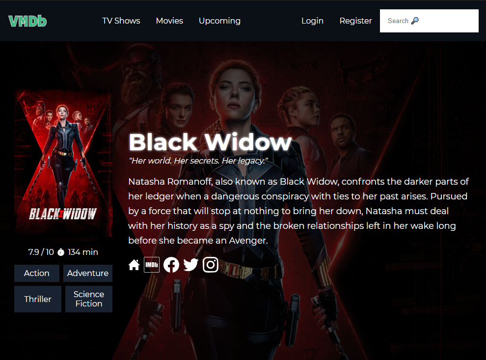

# VMDb
Vue Movie Database App


You need a [TMDb API](https://www.themoviedb.org/documentation/api) key to run the project locally.
Create and .env file in root directory and put your API Key as shown below:
```
VITE_KEY=YOURAPIKEY

```
